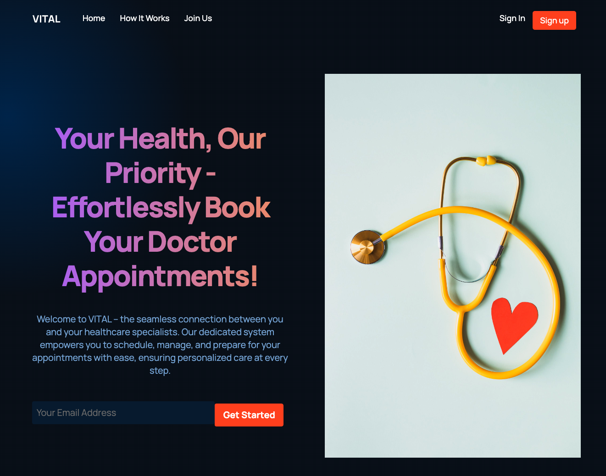
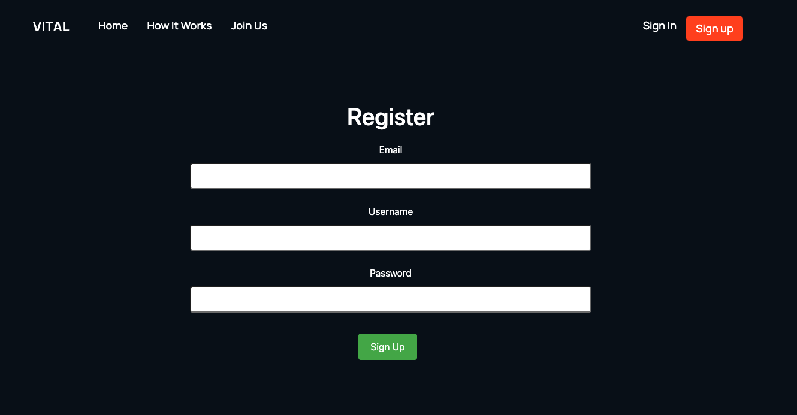
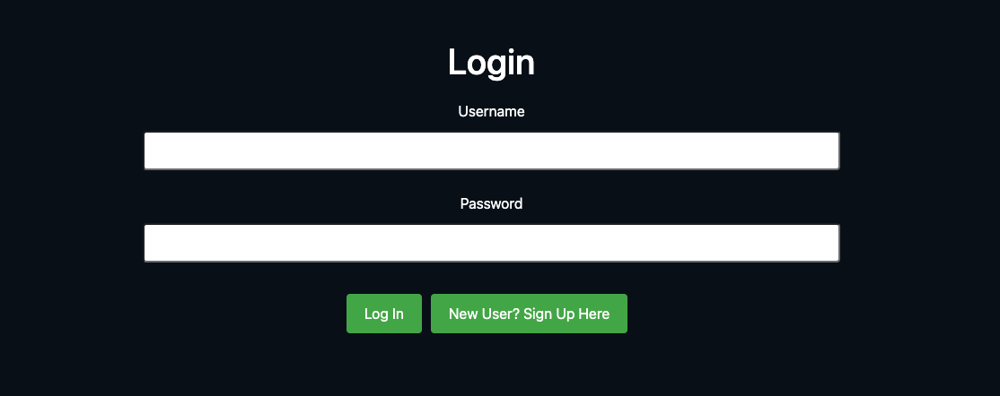
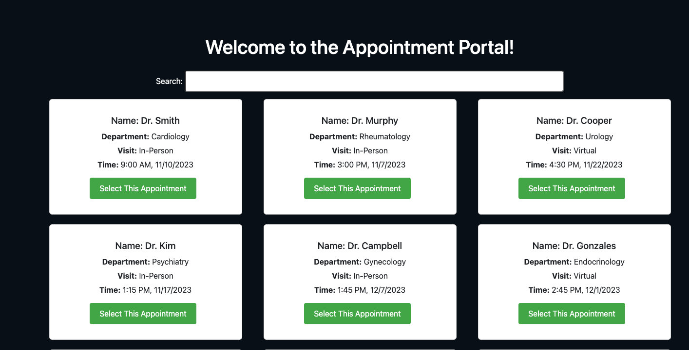
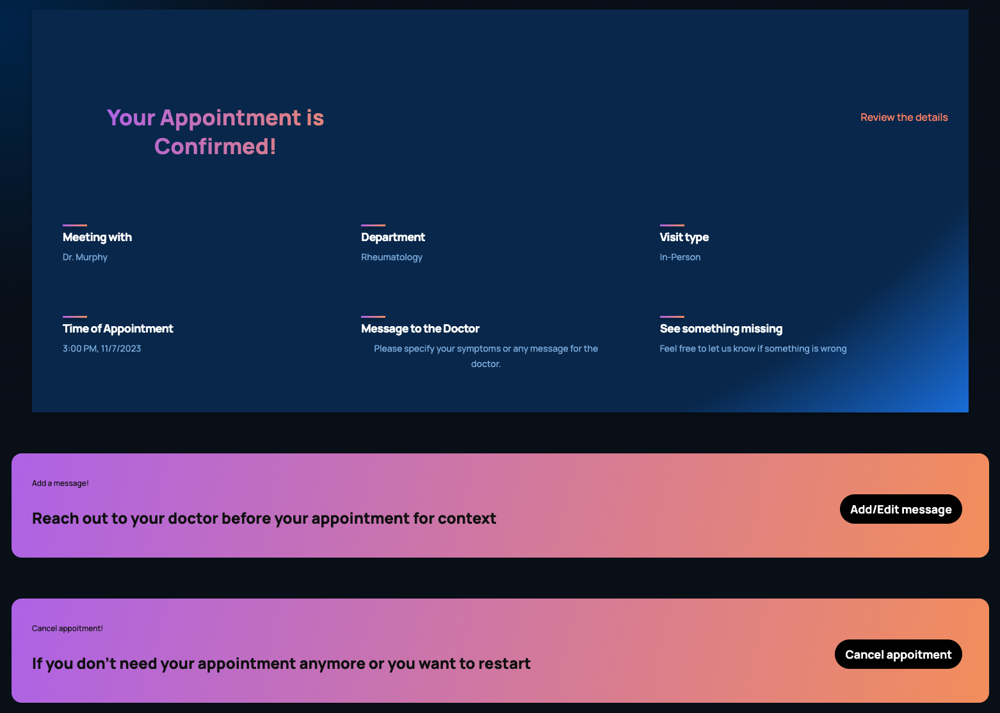
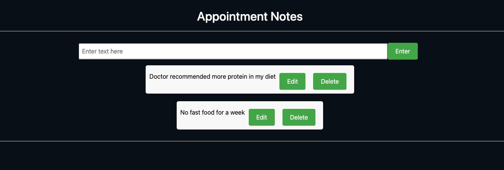

# VITAL (Final Version)

VITAL (Virtual Integrated Time and Appointment Liaison) is a hospital appointment scheduler for patients to be able to book appointments with providers if they are a hospital member. Patients are able to book available times, send a message to their providers before their appointment with symptoms, concerns, medications, etc., keep track of their doctor’s recommendations during their appointments, and view/edit/delete both their messages and recommendations.

This is a reiteration of Project 3 (information below), with the main purpose of making our application more accessible, usable, and coherent. These are the added features to create this final version:

- user authentication with Passport
- using a pre-set color palette for a more unity between pages (see below)
- an appointment selection page that allows patients to either confirm their appointment or go back to the appointment booking page
- allowing the whole application to be used and navigated through with only the keyboard
- having an Accessibility score of 100 for all pages (using Lighthouse)
- having the whole application be responsive so that both desktop and mobile users are able to use it
- conducting 6 user studies (3 per member) to determine how effective and intuitive our application is (fixed the main changes they brought up)
- added two different typographies to our application
- adding a separate navbar for login/sign up pages to only allow user to navigate back to home page while unauthenticated

Created by Srija Gadiraju & Senay Tilahun

Design Document: [here](https://docs.google.com/document/d/1WbJf9y3eyiVDzyMLi3fp7mMP7u2sID_RajBZ9RVvzyk/edit?usp=sharing)

Slides: [here](https://docs.google.com/presentation/d/159Q970wUppgrnvJBeWqMwolbRyurYfYSv0ajo7fmWYc/edit?usp=sharing)

## Demo

Walkthrough Video: NEED TO ADD

Website Link: NEED TO ADD

## Color Palette:


The rich black color is used as the application's main background for pages. Oxford blue is used for the footer, More About Us section, and the appointment selection and confirmation sections. Dartmouth green and Engineering orange are used for buttons on all the pages. Salmon is used for headers and text on various pages.

## Typography Used:

Both are from fonts.google.com


## Screenshots

NEED TO ADD!

# VITAL (Project 3)

VITAL is a hospital appointment scheduler for patients to be able to book appointments with providers if they are a hospital member. Patients are able to book available times, send a message to their providers before their appointment with symptoms, concerns, medications, etc., keep track of their doctor’s recommendations during their appointments, and view/edit/delete both their messages and recommendations.

Walkthrough Video: [here](https://youtu.be/_JvaXSXABQ4)

Website Link: [here](https://vital-stqk.onrender.com)

## Screenshots














## Class reference

Link: https://johnguerra.co/classes/webDevelopment_fall_2023/

## Installation

To set up Vital, you'll need the following:

Clone the repository:

```
git clone https://github.com/srijagadiraju/VITAL
```

Navigate to the root directory:

```
cd VITAL
npm install
cd front
npm install
npm run build
cd..
npm start
```

### Dependencies:

#### Backend server

```
"body-parser": "^1.20.2",
"cookie-parser": "~1.4.4",
"debug": "~2.6.9",
"dotenv": "^16.3.1",
"express": "^4.18.2",
"express-session": "^1.17.3",
"http": "^0.0.1-security",
"mongodb": "^6.2.0",
"morgan": "~1.9.1",
"passport": "^0.6.0"
```

#### frontend dependencies

```
"dotenv": "^16.3.1",
"react": "^18.2.0",
"react-dom": "^18.2.0",
"react-hook-form": "^7.48.1",
"react-icons": "^4.11.0",
"react-router-dom": "^6.18.0"
```

To install these dependencies, you can run the command above once you've cloned the repo

## Usage

```
- Vital offers the following features:

- Register/Login Page: Sign in to be directed to appointment portal page.

- Filter: Use filter on appointment portal page to narrow down search to specific department, time, date, or doctor.

- Send A Message To Doctor: After selecting an appointment, you can directly message that doctor with symptoms, concerns, etc.

- Recommendations: You can use the Appointment Notes page during appointments to write down doctor's recommendations, lifestyle changes, medication usages, etc.
```

## Features

- Home Page/Unauthenticated page
  -- Hero, explains what Vital is, how it works, and CTAs to join
- Login/Register Page
- Patient Portal page
  -- Main Page with all appointments and choosing departments with search bar
  -- Patients can filter through all appointments and choose the time/date that is best for their schedule
- Appointment confirmation page
  -- View confirmed appointment with selected provider
  -- Patients can add messages, edit messages, or delete messages for their doctors before their visit with symptoms, concerns, and other health problems
- Appointment Tracker Page
  -- Patients are able to keep track of their doctors’ recommendations, medication usages, and other things discussed with their doctors during their appointments
  -- Patients can look back at and update these entries at any point to keep track of the recommendations and can delete their notes whenever

## Configuration

There are no specific configuration requirements for Vital. The project is designed to be straightforward to set up and use.

## License

This project is licensed under the MIT License.
